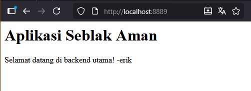
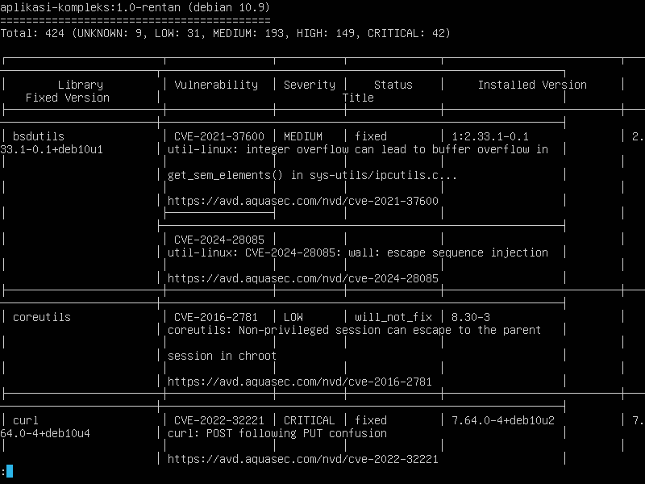
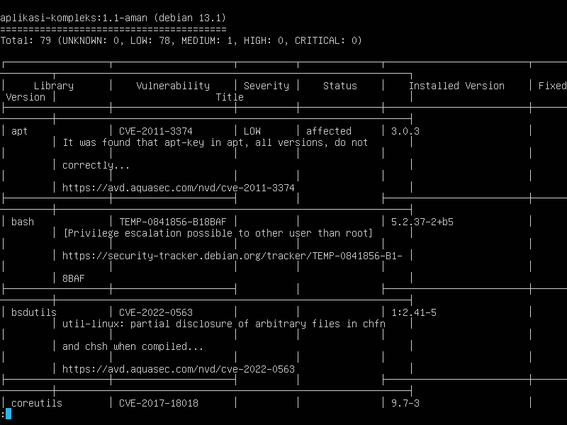

# PROYEK SEBLAK AMAN
_The name is so random ngl_



1. Build (execute at project's root folder)
   ```bash
   docker build -t <image-name> -f build/Dockerfile.fixed .
   ```

2. Run in a container
   ```bash
   docker run -d -p 8889:80 --name <container-name> <image-name>
   ```

3. Open in your browser
   [http://localhost:8889](http://localhost:8889)

   Alternatively
   ```bash
   curl localhost:8889
   ```

# Analisis Hasil Scanning Trivy

- **Image:** aplikasi-kompleks:1.0-rentan & aplikasi-kompleks:1.1-aman
- **Tanggal:** 5 November 2025
- **Penulis:** Erik Triayuda Wijaya


### aplikasi-kompleks:1.0-rentan
**Log:** [Trivy Report 1.0-Rentan](reports/M12_Trivy_Aplikasi-Kompleks_1.0-rentan.txt)



Total kerentanan yang ditemukan: 424 

| Tipe | Critical | High | Medium | Low |
|---|---|---|---|---|
| Jumlah | 19 | 44 | 40 | 19 |

Contoh CVE: CVE-2021-31535
"libX11: Missing request lengths checks"

Berdasarkan [www.cve.org](https://www.cve.org):
Versi libx11 sebelum 1.7.1 dapat memberi kemungkinan penyerang untuk melakukan serangan untuk mengeksekusi arbitary code.


### aplikasi-kompleks:1.1-aman
**Log:** [Trivy Report 1.1-Aman](reports/laporan-bersih.txt)



Total kerentanan yang ditemukan: 79

| Tipe | Critical | High | Medium | Low | Unknown |
|---|---|---|---|---|---|
| Jumlah | 0 | 0 | 1 | 78 | 0 |

Pada build terbaru, critical problem yang muncul pada versi sebelumnya kini telah tiada. Hal ini bisa diperiska pada [laporan_bersih.txt](laporan_bersih.txt)


## QnA?
Q: Apakah port yang digunakan untuk menampilkan index() tetap?  
A: Tidak, port bisa diubah pada `app.py` dan saat mengeksekusi `docker run -d -p <port anda> ...`


## Kesimpulan
Pada praktikum ini, beberapa poin penting yang dapat diambil (khususnya oleh penulis):
- Konfigurasi source file harus dilakukan dengan sangat hati-hati, apabila terdapat perbandingan variabel atau string, harap untuk dilakukan dengan format yang benar.
- Proses build dan running pada docker image/container dapat dilakukan dalam banyak iterasi. Sehingga proses dapat terasa redundan. Sebaiknya, membuat shell script atau bentuk otomasi agar proses build and trial dapat dilakukan lebih cepat.
- Jika menggunakan lebih dari satu servis yang memerlukan running port, sebaiknya untuk sering memeriksa konfigurasi nomor port yang digunakan agar tidak terjadi kesalahan seperti ketidaksesuaian nginx dengan gunicorn.


Any reports, documentation, logs is in the `reports/` folder. Documented screenshots are located in `screenshots/`.
  
Written in pain, 
Quackeyikz
